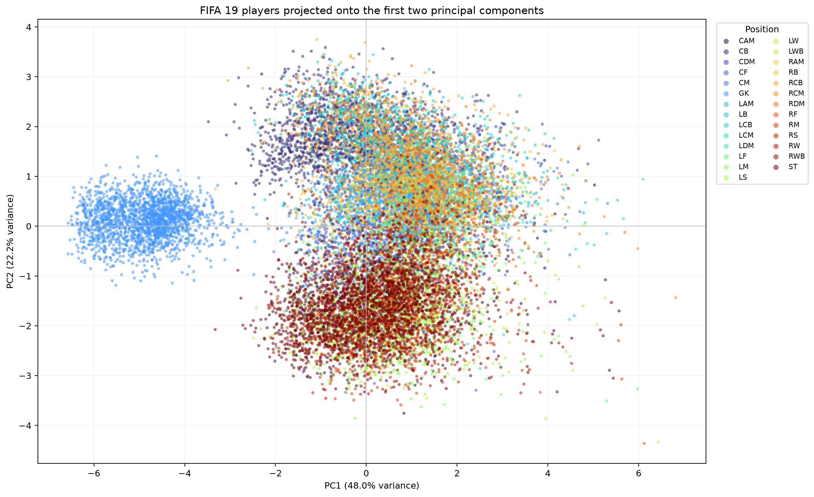

# Finding key factors behind football player performance with PCA

## 1. Aim and data

This project uses Principal Component Analysis (PCA) to reduce nine correlated
FIFA 19 player attributes into a smaller number of uncorrelated dimensions. The
source file is the
[FIFA 19 Complete Player Dataset on Kaggle](https://www.kaggle.com/datasets/javagarm/fifa-19-complete-player-dataset).

The selected variables are `Finishing`, `ShortPassing`, `Dribbling`,
`SprintSpeed`, `Strength`, `Stamina`, `Interceptions`, `StandingTackle`, and
`Value`. `Position` is excluded from the PCA calculation and retained as the
color label for the final plot. This is important because including the label
would allow the traditional positions to determine the components instead of
letting performance attributes reveal their own structure.

The CSV is read with `encoding="cp1252"`. Player values are converted to euros:
for example, `€110.5M` becomes `110500000` and `€500K` becomes `500000`.
Rows missing any selected feature, name, or position are removed. This leaves
18,147 of the original 18,207 players.

## 2. What PCA does

PCA replaces the original correlated variables with new axes called principal
components. Each component is a weighted linear combination of the original
features:

```
PC_j = w_1j z_1 + w_2j z_2 + ... + w_pj z_p
```

The first component points in the direction of greatest variance in the data.
The second captures the greatest remaining variance while being perpendicular
to the first, and later components follow the same rule. Perpendicular
components are uncorrelated. Keeping the first few components therefore gives a
compact representation that preserves as much variation as possible.

The implementation follows these steps:

1. Standardize every feature with `z = (x - mean) / standard deviation`.
2. Calculate the covariance matrix `C = Z^T Z / (n - 1)`.
3. Find the eigenvalues and eigenvectors of the symmetric covariance matrix.
4. Sort eigenvalues from largest to smallest and reorder their eigenvectors.
5. Select the first two eigenvectors as the projection matrix `W`.
6. Calculate two-dimensional player scores with `T = ZW`.

Standardization is necessary because the attributes use ratings near 0–100,
whereas `Value` is measured in euros. Without scaling, value would dominate the
covariance matrix simply because of its unit and numerical size.

### Eigenvalues and eigenvectors

For a square matrix `C`, a non-zero vector `v` is an eigenvector when:

```
C v = λ v
```

Multiplication by `C` does not rotate this particular vector; it only scales it
by the eigenvalue `λ`. In PCA, the matrix is the covariance matrix:

- an **eigenvector** gives a direction through feature space and its entries
  are the feature loadings;
- its **eigenvalue** is the amount of variance along that direction;
- `eigenvalue / sum(all eigenvalues)` is the proportion of total variance
  explained by the component.

Because covariance matrices are symmetric, their eigenvectors can be chosen
orthogonal. This supplies the uncorrelated axes needed by PCA. The sign of an
eigenvector is arbitrary: `v` and `-v` describe the same axis. The code fixes a
consistent sign only to make tables and implementation comparisons easier.

The method has its roots in Pearson's closest-fit formulation and Hotelling's
development of principal components. The
[NIST PCA explanation](https://www.itl.nist.gov/div898/handbook/pmc/section5/pmc55.htm)
provides a modern description of the covariance/eigenvector formulation.

## 3. Results

| Component | Eigenvalue | Variance explained | Cumulative variance |
|---|---:|---:|---:|
| PC1 | 4.3172 | 47.97% | 47.97% |
| PC2 | 2.0018 | 22.24% | 70.21% |
| PC3 | 0.9745 | 10.83% | 81.03% |
| PC4 | 0.7524 | 8.36% | 89.39% |

The first two components preserve 70.21% of the variation in the nine
standardized features. They are suitable for a useful two-dimensional summary,
although the plot necessarily discards the remaining 29.79%.

### Component loadings

| Feature | PC1 | PC2 |
|---|---:|---:|
| Finishing | 0.3279 | -0.4219 |
| ShortPassing | 0.4416 | -0.0339 |
| Dribbling | 0.4235 | -0.2659 |
| SprintSpeed | 0.3418 | -0.2891 |
| Strength | 0.1067 | 0.3897 |
| Stamina | 0.4213 | 0.0676 |
| Interceptions | 0.3025 | 0.5059 |
| StandingTackle | 0.3004 | 0.5016 |
| Value | 0.1751 | -0.0517 |

**PC1: broad outfield capability.** Every loading is positive. The largest
weights belong to short passing, dribbling, and stamina, with meaningful
contributions from speed, finishing, interceptions, and tackling. High PC1
scores therefore indicate well-developed general outfield attributes rather
than one narrow specialist skill. Goalkeepers form a separate low-PC1 group
because these selected variables are mainly outfield skills.

**PC2: defensive/physical versus attacking profile.** Interceptions, standing
tackle, and strength have strong positive loadings, while finishing, sprint
speed, and dribbling point in the negative direction. High PC2 players are
closer to a "Defensive Rock" profile. Low PC2 players are closer to attacking
finishers or fast dribblers. Players near the middle combine these tendencies
more evenly. Short passing, stamina, and value contribute little to this
particular contrast.

The components are data-driven continua, not hard clusters. The archetype names
are interpretations of the loadings; PCA itself does not assign a player to a
discrete class.

### Position-colored visualization



The plot supports the loading interpretation. Goalkeepers make the clearest
separate group at very low PC1. Defenders tend toward positive PC2, attackers
toward negative PC2, and midfield roles overlap the center. The overlap is
expected: traditional positions are broad labels, and players in the same
position can have different styles.

## 4. NumPy and pure-Python implementations

The NumPy version uses array operations for standardization, covariance, and
projection. It uses `numpy.linalg.eigh` for the symmetric covariance matrix and
does not use `sklearn` or any other PCA library.

The pure-Python version stores matrices as lists of lists and manually
implements:

- matrix transpose;
- matrix multiplication;
- column means, standard deviations, and Z-scores;
- covariance calculation;
- projection onto selected eigenvectors.

As allowed by the task, the list version converts only the small 9 × 9
covariance matrix to NumPy for eigen-decomposition.

### Benchmark and validation

The table reports the median of three runs from standardization through final
projection on all 18,147 rows. Timings depend on the computer and current
system load, so they should be treated as a measured comparison rather than
universal constants.

| Pipeline | Median time |
|---|---:|
| NumPy | 0.002519 s |
| Pure Python | 0.305237 s |
| NumPy speed-up | 121.2× |

| Validation check | Maximum absolute difference |
|---|---:|
| Covariance matrices | 1.33 × 10^-15 |
| Two-dimensional scores | 6.22 × 10^-15 |

The tiny differences are normal floating-point rounding errors. They confirm
that both pipelines perform the same PCA calculation.

NumPy is much faster because its operations run over compact homogeneous arrays
inside compiled code. Python lists store references to Python objects, and the
manual version repeatedly executes interpreted loops, indexing, type checks,
and arithmetic object handling. NumPy broadcasting moves loops out of Python
and into optimized compiled routines, as described in the
[official NumPy broadcasting guide](https://numpy.org/doc/stable/user/basics.broadcasting.html).

## 5. Limitations

- PCA finds linear directions of variance, not causes of good performance.
- `Value` is highly right-skewed; standardization fixes its scale but not its
  distribution shape.
- The chosen attributes strongly favor outfield play, so goalkeeper separation
  is partly built into the feature selection.
- FIFA ratings are game attributes rather than observed match statistics.
- Despite the scenario's historical World Cup motivation, the required FIFA 19
  dataset is a single-edition player database. It cannot by itself support
  claims about changes between World Cup tournaments.
- Position coloring evaluates visual alignment but is not a statistical
  clustering test.

## 6. References

1. Pearson, K. (1901), [*On Lines and Planes of Closest Fit to Systems of
   Points in Space*](https://www.stats.org.uk/pca/Pearson1901.pdf).
2. Hotelling, H. (1933), [*Analysis of a Complex of Statistical Variables into
   Principal Components*](https://doi.org/10.1037/h0070888).
3. NIST/SEMATECH, [*Principal
   Components*](https://www.itl.nist.gov/div898/handbook/pmc/section5/pmc55.htm).
4. NumPy documentation, [*Broadcasting*](https://numpy.org/doc/stable/user/basics.broadcasting.html).
5. Kaggle, [*FIFA 19 Complete Player
   Dataset*](https://www.kaggle.com/datasets/javagarm/fifa-19-complete-player-dataset).
