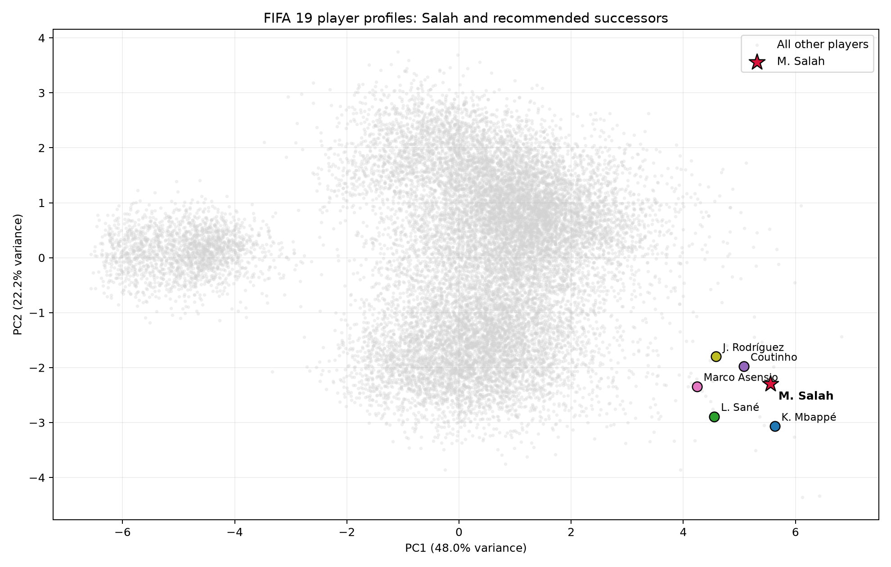

# The Scouting Engine — Finding Salah's successor

## Data and method

The cleaned pool contains **18,147 players**. The target is **M. Salah** (Liverpool, RM, age 26). Every player is represented by the same nine features as Task 2.2:

`Finishing`, `ShortPassing`, `Dribbling`, `SprintSpeed`, `Strength`, `Stamina`, `Interceptions`, `StandingTackle`, `Value`.

For the main experiment, each feature is converted to a population z-score, `(value - mean) / standard deviation`. Thus a one-unit difference has the same meaning—one dataset standard deviation—for every feature. All metric calculations compare the target against the full matrix in vectorized NumPy code.

## Standardized top-five results

### Cosine

Compares the angle between two vectors. It rewards the same overall direction/profile and is less sensitive to magnitude. **higher is more similar.**

| Rank | Name | Age | Club | Position | Score |
|---|---|---|---|---|---|
| 1 | K. Mbappé | 19 | Paris Saint-Germain | RM | 0.996827 |
| 2 | Marco Asensio | 22 | Real Madrid | RW | 0.995267 |
| 3 | A. Griezmann | 27 | Atlético Madrid | CAM | 0.994631 |
| 4 | E. Hazard | 27 | Chelsea | LF | 0.993908 |
| 5 | L. Sané | 22 | Manchester City | LW | 0.993447 |

### Euclidean

Measures straight-line distance. It rewards players whose standardized attribute levels are jointly close to Salah's. **lower is more similar.**

| Rank | Name | Age | Club | Position | Score |
|---|---|---|---|---|---|
| 1 | Coutinho | 26 | FC Barcelona | LW | 1.62564 |
| 2 | A. Griezmann | 27 | Atlético Madrid | CAM | 1.96338 |
| 3 | J. Rodríguez | 26 | FC Bayern München | LAM | 1.97307 |
| 4 | L. Sané | 22 | Manchester City | LW | 2.01528 |
| 5 | Cristiano Ronaldo | 33 | Juventus | ST | 2.07455 |

### Manhattan

Adds absolute feature-by-feature gaps. It measures absolute levels but is less dominated by one large mismatch than squared Euclidean distance. **lower is more similar.**

| Rank | Name | Age | Club | Position | Score |
|---|---|---|---|---|---|
| 1 | J. Rodríguez | 26 | FC Bayern München | LAM | 3.81678 |
| 2 | A. Griezmann | 27 | Atlético Madrid | CAM | 3.8988 |
| 3 | K. Mbappé | 19 | Paris Saint-Germain | RM | 3.92857 |
| 4 | Coutinho | 26 | FC Barcelona | LW | 3.99864 |
| 5 | L. Sané | 22 | Manchester City | LW | 4.41329 |

### Pearson

Correlates the shapes of two player profiles after centering each player's vector. Similar rises and falls matter more than the players' absolute levels. **higher is more similar.**

| Rank | Name | Age | Club | Position | Score |
|---|---|---|---|---|---|
| 1 | E. Hazard | 27 | Chelsea | LF | 0.998189 |
| 2 | K. Mbappé | 19 | Paris Saint-Germain | RM | 0.998143 |
| 3 | Neymar Jr | 26 | Paris Saint-Germain | LW | 0.998008 |
| 4 | P. Dybala | 24 | Juventus | LF | 0.99753 |
| 5 | L. Messi | 31 | FC Barcelona | RF | 0.997115 |

## Agreement and differences between metrics

Each cell is the number of shared players between two top-five lists:

| Metric | Cosine | Euclidean | Manhattan | Pearson |
|---|---|---|---|---|
| Cosine | 5 | 2 | 3 | 2 |
| Euclidean | 2 | 5 | 4 | 0 |
| Manhattan | 3 | 4 | 5 | 1 |
| Pearson | 2 | 0 | 1 | 5 |

Euclidean and Manhattan agree most because both compare absolute standardized attribute levels. Manhattan adds each gap directly; Euclidean squares gaps before combining them, so one unusually large mismatch has more influence on Euclidean distance.

Cosine and Pearson emphasize profile shape. Cosine keeps the origin and compares vector direction; Pearson first subtracts each player's own across-feature mean, so it ignores a general level shift even more strongly. They can therefore select an elite player with Salah-like strengths and weaknesses despite larger absolute gaps. Limited overlap is expected: 'same levels' and 'same shape' are different definitions of similar.

## Standardized versus raw experiment

The raw top-five lists are:

| Metric | Rank | Name | Position | Value | Score |
|---|---|---|---|---|---|
| Cosine | 1 | Coutinho | LW | €69.5M | 1 |
| Cosine | 2 | J. Rodríguez | LAM | €69.5M | 1 |
| Cosine | 3 | L. Sané | LW | €61.0M | 1 |
| Cosine | 4 | Bernardo Silva | RW | €59.5M | 1 |
| Cosine | 5 | C. Eriksen | CAM | €73.5M | 1 |
| Euclidean | 1 | Coutinho | LW | €69.5M | 26.0768 |
| Euclidean | 2 | J. Rodríguez | LAM | €69.5M | 29.8998 |
| Euclidean | 3 | J. Oblak | GK | €68.0M | 1.5e+06 |
| Euclidean | 4 | L. Modri? | RCM | €67.0M | 2.5e+06 |
| Euclidean | 5 | De Gea | GK | €72.0M | 2.5e+06 |
| Manhattan | 1 | J. Rodríguez | LAM | €69.5M | 60 |
| Manhattan | 2 | Coutinho | LW | €69.5M | 66 |
| Manhattan | 3 | J. Oblak | GK | €68.0M | 1.50036e+06 |
| Manhattan | 4 | L. Modri? | RCM | €67.0M | 2.50013e+06 |
| Manhattan | 5 | De Gea | GK | €72.0M | 2.50031e+06 |
| Pearson | 1 | E. Hazard | LF | €93.0M | 1 |
| Pearson | 2 | Neymar Jr | LW | €118.5M | 1 |
| Pearson | 3 | K. Mbappé | RM | €81.0M | 1 |
| Pearson | 4 | P. Dybala | LF | €89.0M | 1 |
| Pearson | 5 | L. Messi | RF | €110.5M | 1 |

Raw feature scales make the cause explicit:

| Feature | Raw standard deviation |
|---|---|
| Value | 5.60267e+06 |
| StandingTackle | 21.663 |
| Interceptions | 20.6969 |
| Finishing | 19.5269 |
| Dribbling | 18.9117 |
| Stamina | 15.8959 |
| ShortPassing | 14.6957 |
| SprintSpeed | 14.6514 |
| Strength | 12.5521 |

**Value dominates the raw search.** It is measured in euros (millions), while skill ratings are roughly on a 0–100 scale. For raw Euclidean and Manhattan distance, being close in market value overwhelms hundreds of rating points—hence even positionally implausible matches can appear. Raw cosine and Pearson also become almost 1 for elite players because the huge Value coordinate controls their vector direction and covariation.

Without standardization, 'similar' secretly means **similar in the numerically largest unit**, not equally similar across the chosen football attributes. This is a units-of-measure result, not a football conclusion.

## Recommended shortlist

The recommendation averages each player's full-pool rank across all four standardized metrics, then applies one practical successor rule: the player must be no older than Salah's FIFA 19 age (26). Age is not added to the similarity vector; it is only a final scouting filter.

| Recommendation | Name | Age | Club | Position | Mean metric rank |
|---|---|---|---|---|---|
| 1 | K. Mbappé | 19 | Paris Saint-Germain | RM | 4.25 |
| 2 | L. Sané | 22 | Manchester City | LW | 6.25 |
| 3 | Coutinho | 26 | FC Barcelona | LW | 7.5 |
| 4 | Marco Asensio | 22 | Real Madrid | RW | 11 |
| 5 | J. Rodríguez | 26 | FC Bayern München | LAM | 11.25 |

**Primary recommendation: K. Mbappé.** This player has the strongest combined agreement across absolute-level and profile-shape measures while satisfying the age requirement. The remaining names provide alternatives with different trade-offs: distance-led matches reproduce Salah's current levels, while angle/correlation-led matches reproduce the shape of his strengths.

This is a first-pass shortlist, not a transfer decision. The data are FIFA 19 ratings, Value is time-sensitive and partly subjective, and position, footedness, tactical role, injuries, cost, and current form still require scout review.

## Bonus: PCA visual check

PC1 and PC2 retain **70.21%** of the nine-feature standardized variance (47.97% + 22.24%). The highlighted candidates occupy Salah's broader high-level attacking region, which supports the shortlist as a sensible first pass. They need not be the five closest points in this plot: the search used all nine dimensions and four definitions of similarity, while the chart discards the variance outside the first two components.
